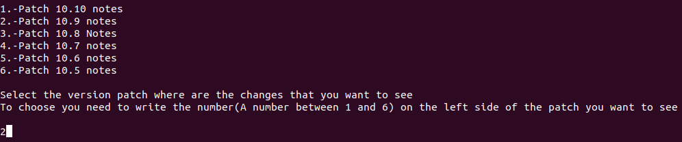
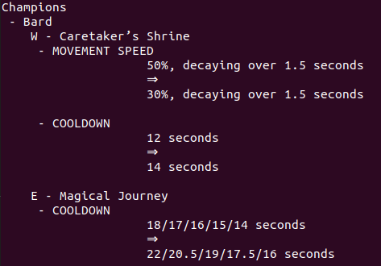

# Web Scraper

> This project is a web scraper that takes information about the [League of Legends](https://na.leagueoflegends.com/) web page

The information this program takes is the champions and item updates of the League of Leguends game.

Every two weeks there are some patches inside the game, and this program takes some data of each patch and shows that data to the user.

This program can't access to all the patches, just can access to the last 6 of them.

## Instructions

This program shows an interface inside a terminal.

You need to follow the next instructions if you want to use the program

- Run the program (The instructions of how to run the program are below, inside usage section)

- It will show you a list with the 6 last patches of the game

- Choose 1 of the patches that you want to see. Each patch has a number beside, so you must write the number beside the patch you want to see (write the number inside the terminal)

- It will show you the notes of the patch you chose (Just the information about items and Champions)

- Finally, you have the option to choose another patch to see it or finish the program.

  - If you want to see another patch, write 'yes' inside the terminal

  - If you want to finish the program just write 'no' inside the terminal

## Built With

- Ruby

## Live Demo

[Live Demo Link](https://repl.it/@LOctavio/web-scraper)

## Getting Started

To get a local copy up and running follow these simple example steps.

### Prerequisites

- Install Ruby
- Install the next libraries
  - nokogiri
  - open-uri
- Install Rspec

### Setup

Clone the repoitory on your local enviroment

### Usage

Join to the main directory of the project inside a terminal in your OS and run 'ruby bin/main.rb'

### Run tests

To run the tests you need to have installed Rspec and run 'rspec' insde the main directory of the project

## Authors

👤 **Luis Octavio Ramirez Cruz**

- Github: [@LOctavio](https://github.com/LOctavio)
- Twitter: [@Octavio_ram431](https://twitter.com/Octavio_ram431)
- Linkedin: [linkedin](https://www.linkedin.com/in/luis-octavio-ramirez-cruz)

## 🤝 Contributing

Contributions, issues and feature requests are welcome!

Feel free to check the [issues page](https://github.com/LOctavio/web-scraper/issues).

## Show your support

Give a ⭐️ if you like this project!

## 📝 License

This project is [MIT](lic.url) licensed.
